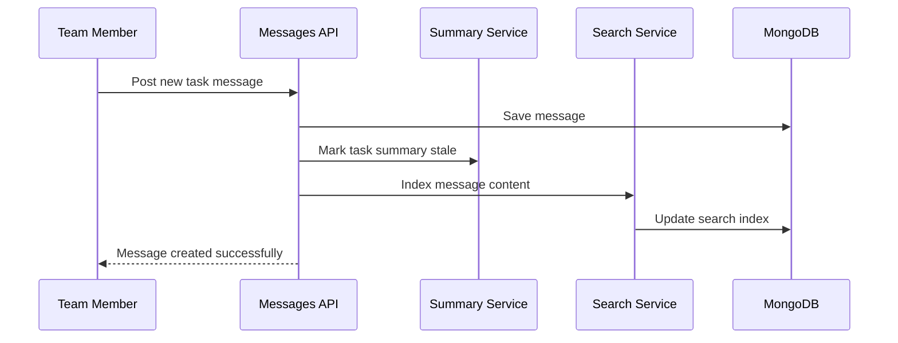
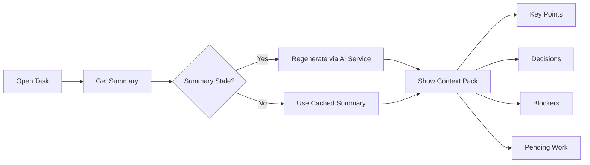
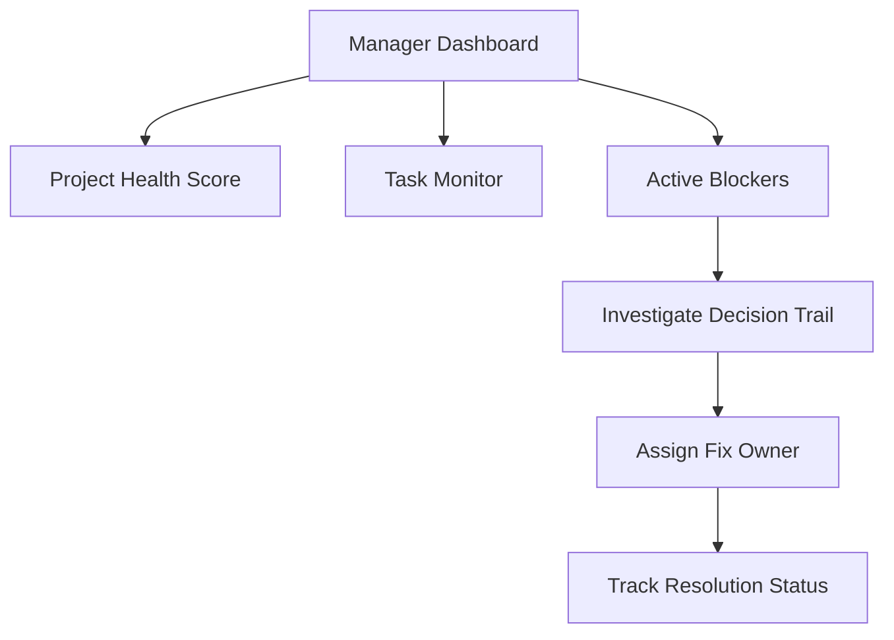
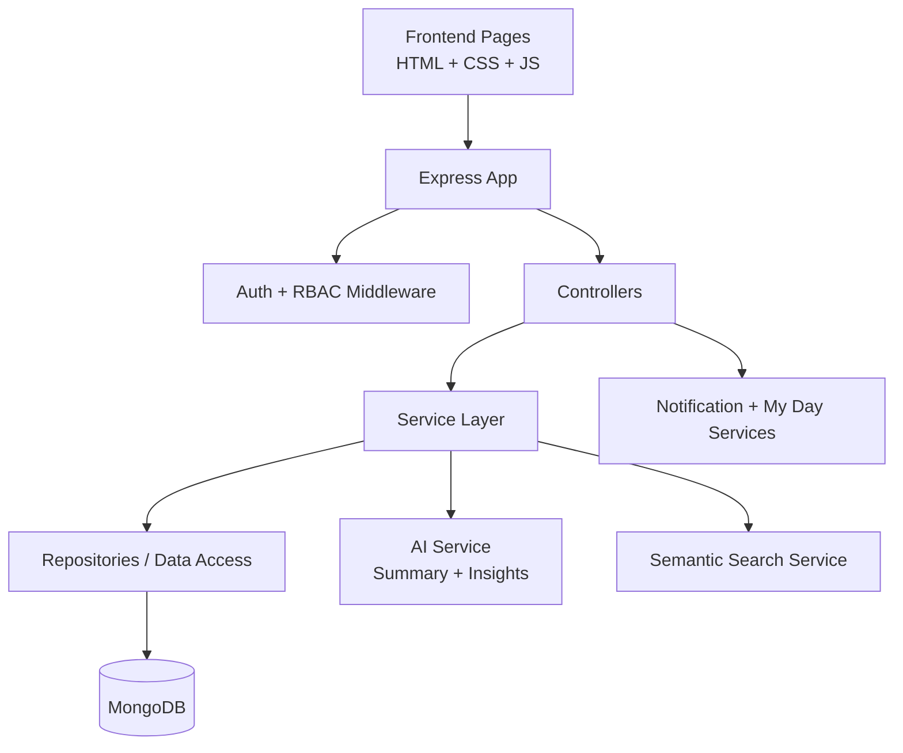

# <div align="center">SynergySphere</div>

<div align="center">
	
</div>

<div align="center">
	
</div>

<div align="center">
	
	
	
	
	
</div>

---

## Overview

SynergySphere is a collaboration platform designed for execution-heavy teams that need to **plan, communicate, decide, and deliver** in one place.

It combines:

- project and task management
- structured team communication
- role-aware workflows for manager and developer personas
- AI-enhanced collaboration features:
	- conversation summaries
	- decision tracking
	- smart contextual search

---

## Problem Statement (Real-World Scenario)

In most student teams, startup teams, and hackathon squads, the work is split across multiple disconnected tools:

- tasks in one app
- updates in group chats
- technical discussions in scattered threads
- decisions buried inside long message histories

### Typical Failure Pattern

1. A bug appears close to deadline.
2. Team remembers discussing a similar issue last week.
3. Nobody can find the exact decision, fix, or owner quickly.
4. Same conversation repeats.
5. Delivery slows down; stress increases.

### Example

A new developer joins a task with 150+ messages.

- Without intelligent context: they spend hours reading chat history.
- With SynergySphere: they get an AI summary, see blockers, view marked decisions, and search by intent such as "JWT login issue" in seconds.

### Problem We Solve

SynergySphere turns collaboration from **message-heavy and memory-dependent** into **decision-driven and execution-focused**.

---

## Key Features

### Core Collaboration

- secure authentication and profile management
- project creation, team membership, and role-based access
- task lifecycle management (todo, inprogress, done)
- task assignment and workload visibility
- project and task communication threads
- notifications and personal My Day planning view

### Advanced Intelligent Features

#### 1) AI Conversation Summary

- auto-generates discussion summaries for tasks
- extracts key points, issues, blockers, and pending work
- summary caching for performance
- auto-invalidates summary on new message activity

#### 2) Decision Tracking

- mark messages as:
	- decision
	- final_fix
	- important_update
	- blocker
- track priority, status, and tags
- create a clean "Key Decisions" layer over noisy chat

#### 3) Smart Search

- natural language and keyword-based retrieval
- entity-aware filters (error logs, code snippets, discussions)
- find related discussions from a message
- task-level and project-level search

---

## End-to-End Workflows

### Workflow A: Message to Intelligence



### Workflow B: Task Understanding in Seconds



### Workflow C: Manager Risk Review



---

## System Architecture



---

## Tech Stack

| Layer | Technologies |
|---|---|
| Frontend | HTML, CSS, Vanilla JavaScript |
| Backend | Node.js, Express |
| Database | MongoDB (Mongoose ODM) |
| Authentication | JWT, bcrypt/bcryptjs |
| AI Layer | Extensible AI service (mock + OpenAI-ready integration pattern) |
| Search | Indexed search with semantic-ready service design |
| Dev Tooling | nodemon, dotenv, mongodb-memory-server |

---

## API Surface (High Level)

Base URL: `http://localhost:5000/api`

- Auth: signup, login, profile fetch/update
- Projects: CRUD, members, health score, workload, risks, activity, messages
- Tasks: create, assign, update, delete
- Messages: task messages, convert message to task
- Notifications: list, mark read, mark all read
- My Day: personalized daily execution feed
- Summaries: task summary, regenerate, project summaries
- Decisions: mark/unmark, filters, blockers, status updates, search
- Search: task search, project search, related discussions, entity-specific retrieval

Detailed endpoint docs are available in the project docs:

- `Intelligent-Project-Collaboration-Platform/docs/FEATURES_1_3_API.md`

---

## Project Structure

```text
MINI_PROJECT/
├── README.md
├── LICENSE
└── Intelligent-Project-Collaboration-Platform/
		├── package.json
		├── QUICK_START.md
		├── IMPLEMENTATION_COMPLETE.md
		├── README_FEATURES_1_3.md
		├── docs/
		│   ├── FEATURES_1_3_API.md
		│   └── IMPLEMENTATION_GUIDE.md
		├── backend/
		│   ├── app.js
		│   ├── server.js
		│   ├── config/
		│   ├── database/
		│   ├── middleware/
		│   ├── models/
		│   ├── repositories/
		│   ├── controllers/
		│   ├── services/
		│   ├── routes/
		│   └── validators/
		├── frontend/
		│   ├── assets/
		│   │   ├── css/
		│   │   ├── js/
		│   │   ├── images/
		│   │   └── fonts/
		│   └── pages/
		├── ai/
		│   ├── experiments/
		│   ├── memory/
		│   ├── models/
		│   └── prompts/
		└── tests/
```

---

## Quick Start (Local Setup)

```bash
git clone <your-repo-url>
cd MINI_PROJECT/Intelligent-Project-Collaboration-Platform
npm install
npm run dev
```

Server starts at:

- `http://localhost:5000`

### Runtime Behavior

- if local MongoDB is available, it connects to `MONGODB_URI` (or local default)
- if local MongoDB is unavailable, it auto-starts an in-memory MongoDB instance for development/demo

### Demo Credentials

- `alice@demo.com / password123` (manager)
- `bob@demo.com / password123`
- `carol@demo.com / password123`

---

## Environment Variables

Create a `.env` file inside `Intelligent-Project-Collaboration-Platform`:

```env
PORT=5000
MONGODB_URI=mongodb://127.0.0.1:27017/synergysphere
JWT_SECRET=your_jwt_secret_here

# Optional AI integration toggles
AI_SERVICE_TYPE=mock
OPENAI_API_KEY=your_openai_key_if_used
```

---

## Why This Project Stands Out in Presentations

- solves a real collaboration pain point, not just CRUD
- demonstrates full-stack engineering with role-aware workflows
- includes practical AI features tied directly to productivity
- shows system thinking: communication, decision memory, and risk visibility in one product
- has implementation depth with modular architecture and documented APIs

---

## Roadmap

- threaded timeline playback for project discussions
- deeper semantic vector embeddings for search relevance
- proactive stress and workload alerting
- one-click conversion from important message to executable task
- analytics dashboards for delivery velocity and blocker resolution time

---

<div align="center">
	
</div>
